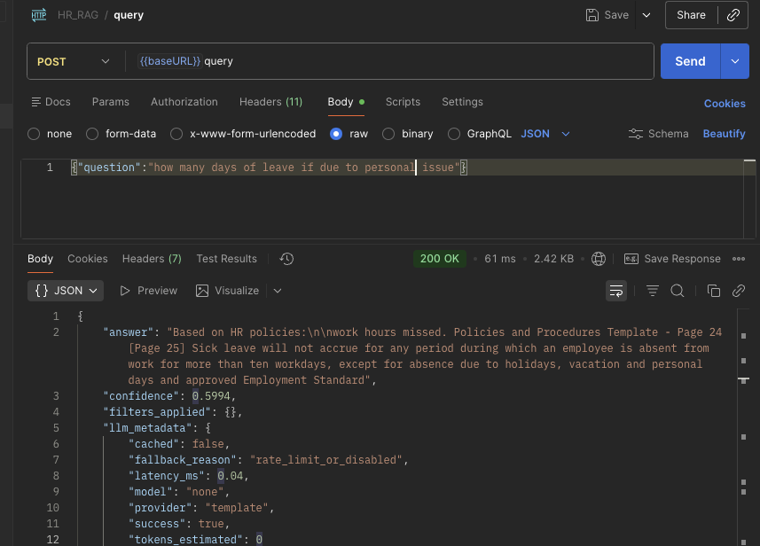
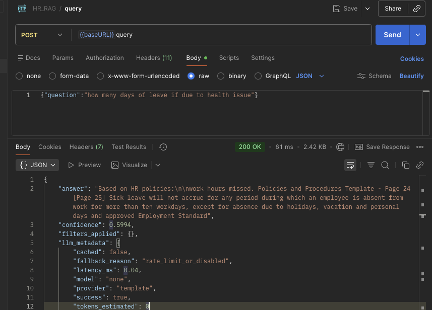

# HR Assistant RAG - Complete Installation & Setup Guide

This guide provides step-by-step instructions to install, configure, and run all components of the HR Assistant RAG system.

---

### Install Required Software

#### macOS (using Homebrew)

```
# Install Python 3.11
brew install python@3.11

# Install Git
brew install git

# Install additional tools
brew install postgresql@15  # For psql client
brew install redis          # For redis-cli
```

#### Windows (using WSL2)

```powershell
# Enable WSL2
wsl --install

# Install Ubuntu from Microsoft Store
# Then follow Ubuntu instructions above

# Or use Chocolatey
choco install python311
choco install docker-desktop
choco install git
```

## Development Environment Setup

### Setup Python Virtual Environment

```bash
# Create virtual environment
python3.11 -m venv venv

# Activate virtual environment
# macOS/Linux:
source venv/bin/activate

# Windows:
.\venv\Scripts\activate

# Verify Python version
python --version  # Should show 3.11.x
```

### Install Dependencies

````bash
# Install production dependencies
pip install -r requirements.txt

# Install development dependencies
pip install -r requirements-dev.txt
````


### Run with Docker

```bash
# Build image
cd ./backend/
docker-compose up
````

### CLI Management Tool ([manage.py](manage.py))

Commands implemented:
```bash
create-admin          # Create admin user interactively
create-user          # Create user with specific role
list-users           # Display all users
change-role          # Update user role
deactivate           # Deactivate user account
create-api-key       # Generate API key for user
init-db              # Initialize database
reset-db             # Reset database (with confirmation)
stats                # Display system statistics
```

### Example API Workflow - (curl or use postman)

1. **Register User**
```bash
curl -X POST http://localhost:5001/api/auth/register \
  -H "Content-Type: application/json" \
  -d '{"username":"test","email":"test@example.com","password":"pass123"}'
```

2. **Login**
```bash
curl -X POST http://localhost:5001/api/auth/login \
  -H "Content-Type: application/json" \
  -d '{"username":"test","password":"pass123"}'
```

3. **Upload Document**
```bash
curl -X POST http://localhost:5001/api/documents \
  -H "Authorization: Bearer $TOKEN" \
  -F "file=@policy.pdf" \
  -F "category=leave_policies"
```

4. **Query**
```bash
curl -X POST http://localhost:5001/api/query \
  -H "Authorization: Bearer $TOKEN" \
  -H "Content-Type: application/json" \
  -d '{"question":"How many vacation days?"}'
```

5. **View Analytics**
```bash
curl http://localhost:5001/api/analytics \
  -H "Authorization: Bearer $TOKEN"
```

### Postman

### Query Screenshot

1. **Query 1**


2. **Query 2**

